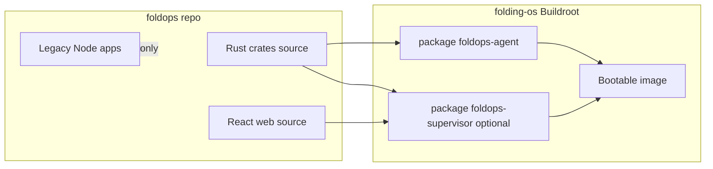
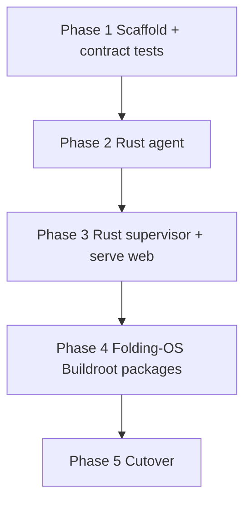

# FoldOps Node → Rust Migration Plan

Add Rust implementations of the agent and supervisor alongside the existing Node apps in the foldops repo, preserve the React SPA unchanged, and produce release-ready binaries packaged into Folding-OS images via Buildroot (Milestone 3)—not built on farm nodes at runtime.

## Goals

- Rewrite **agent** and **supervisor backend** in Rust while keeping the current repo and **legacy Node apps** under [`apps/agent`](../apps/agent) and [`apps/supervisor`](../apps/supervisor).
- **Keep the React frontend** at [`apps/supervisor/web`](../apps/supervisor/web) — no UI rewrite; API contract must stay stable.
- Ship **prebuilt binaries in the Folding-OS image** per [Folding-OS docs](https://github.com/pacificnm/folding-os/blob/main/doc/README.md) and [FoldOps integration](https://github.com/pacificnm/folding-os/blob/main/doc/foldops-integration.md) (Milestone 3: agent on nodes; supervisor on management host).

## Context from Folding-OS



- Folding-OS v0.1.0 **excludes** FoldOps binaries; **Milestone 3** adds the agent and metrics API.
- Target images are **appliances**: no Git, npm, or rustc on nodes ([engineering spec](https://github.com/pacificnm/folding-os/blob/main/doc/milestone/1-engineering-spec.md)).
- Build system is **Buildroot** (reproducible, package-based) — same pattern as `foldingosctl` (Go package from pinned source).
- FoldOps failure must not block boot or FAH ([foldops-integration.md](https://github.com/pacificnm/folding-os/blob/main/doc/foldops-integration.md)).

**Implication:** `scripts/update-agent.sh` (`git pull` + `npm run build:agent`) is a **legacy dev/Debian workflow**. Folding-OS nodes will update via the OS update system (Milestone 4), not in-place npm builds.

---

## Repo layout (additive)

Add a **Cargo workspace at repo root**; leave npm workspaces untouched.

```text
foldops/
  Cargo.toml                    # workspace
  crates/
    foldops-types/              # shared serde types + validation (replaces @foldops/shared for Rust)
    foldops-agent/              # agent binary
    foldops-supervisor/         # supervisor binary
  apps/
    agent/                      # legacy Node (kept)
    supervisor/                 # legacy Node + web/ React (kept)
  packages/shared/              # legacy TS/Zod (kept for Node + web dev)
```

Root [`package.json`](../package.json) scripts stay for Node/React; add parallel scripts:

- `cargo build --release -p foldops-agent`
- `cargo build --release -p foldops-supervisor`
- `npm run build:web` (unchanged) — supervisor image install includes `web/dist`

---

## Shared API contract

The React app talks to `/api/*` only. Rust must preserve:

| Area | Source of truth today | Rust approach |
|------|----------------------|---------------|
| Ingest body | [`packages/shared/src/schema.ts`](../packages/shared/src/schema.ts) | Port to `foldops-types` with `serde`; mirror field names exactly |
| Control actions | [`packages/shared/src/control.ts`](../packages/shared/src/control.ts) | `const` slice + `is_control_action()` |
| REST responses | [`apps/supervisor/src/routes.ts`](../apps/supervisor/src/routes.ts) | Contract tests against golden JSON fixtures |

**Drift prevention:** add `tests/contract/` with fixture payloads captured from the Node supervisor (ingest, machines list, alerts, logs, deploy). Run in CI for both Node and Rust during transition.

Zod stays for the React/Node dev path; long-term optional JSON Schema export from one side — not required for v1.

---

## Rust stack (recommended)

| Concern | Crate |
|---------|-------|
| Async runtime | `tokio` |
| HTTP server | `axum` + `tower-http` (static files, CORS if needed) |
| HTTP client | `reqwest` |
| SQLite | `rusqlite` (sync, like `better-sqlite3`) |
| WebSocket (agent FAH) | `tokio-tungstenite` |
| System metrics | `sysinfo` + `/sys` reads for temps |
| Config | env vars (same names as today) |
| Logging | `tracing` + `tracing-subscriber` |

Target: **x86_64-unknown-linux-gnu** first (Folding-OS v0.1.0). ARM64 (Pi) later when Folding-OS Milestone 5 lands.

### Development machine prerequisites

See [Installation — Rust development prerequisites](installation.md#rust-development-prerequisites) for `rustup`, apt packages, and build commands. Verify readiness:

```bash
./scripts/check-rust-prereqs.sh
```

Farm nodes running Folding-OS images do not need a Rust toolchain.

---

## Phase 1 — Scaffold + types + CI

1. Root `Cargo.toml` workspace; three crates as above.
2. Port `IngestPayload` and nested structs to `foldops-types`.
3. Add `.github/workflows/rust.yml`: `cargo test`, `cargo clippy`, release build on tag.
4. Document image integration in [`docs/folding-os.md`](folding-os.md):
   - binary names: `foldops-agent`, `foldops-supervisor`
   - install paths: `/usr/bin/...`
   - static web: `/usr/share/foldops/web/` (or embed — see below)
   - env files: `/etc/foldops/agent.env`, `/etc/foldops/supervisor.env`
   - systemd units (new `*.service` files pointing at Rust binaries)

**Deliverable:** empty binaries compile; contract test harness exists.

---

## Phase 2 — Rust agent (highest parity risk)

Mirror modules from [`apps/agent/src/`](../apps/agent/src/) (~1.8k LOC):

| Module | Notes |
|--------|-------|
| `collector` | Host metrics, APT count, reboot flag, log tail |
| `temperatures` | `/sys/class/hwmon`, thermal, optional `sensors -j` |
| `fah-log`, `fah-work-log` | Regex parity with Node |
| `fah-client-db` | `rusqlite` read-only on `client.db`; port scoring/merge logic verbatim |
| `fah-websocket`, `fah-control` | One-shot WS read + command send to FAH :7396 |
| `fah-status` | Same merge priority as Node |
| `agent-http` | axum routes: `/logs/fah`, `/logs/work`, `/control`, `/control/status`, `/update` |
| `node-control`, `run-update` | `systemctl` + update script spawn |

**Env vars:** identical to [`apps/agent/.env.example`](../apps/agent/.env.example) (`AGENT_TOKEN`, `SUPERVISOR_URL`, `FAH_*`, feature flags).

**Tests:** fixture `client.db` JSON rows, sample log files, WS mock.

**Deliverable:** drop-in replacement for Node agent; same ingest JSON and agent HTTP API.

---

## Phase 3 — Rust supervisor

Mirror [`apps/supervisor/src/`](../apps/supervisor/src/) (~15 modules):

| Module | Notes |
|--------|-------|
| `db` | SQLite schema: `machines`, `snapshots`, runtime column migration for temps |
| `routes` | All `/api/*` endpoints; only `POST /ingest` bearer-auth |
| `alerts/*` | Evaluate, stuck detection, Discord/Slack webhooks, 60s interval + post-ingest |
| `agent-*` | Outbound HTTP proxy to agents by hostname |
| `deploy` | Async deploy runs, `deploy_runs` table |
| `fah-projects` | External API + 1h cache |
| static SPA | Serve React build |

**Static web strategy (for OS image):**

- **Recommended:** install `web/dist` to `/usr/share/foldops/web/` in Folding-OS overlay; axum `ServeDir` + SPA fallback (same behavior as [`server.ts`](../apps/supervisor/src/server.ts)).
- Alternative: `rust-embed` for a single supervisor artifact — simpler for Buildroot but harder to iterate on UI-only updates.

**Deliverable:** React app works unchanged against Rust supervisor; same DB file format so existing `foldops.db` can be reused.

---

## Phase 4 — Folding-OS packaging (coordinated in `pacificnm/folding-os`)

**FoldOps repo (done):** reference Buildroot packages, env templates, vendor/release scripts, and CI release assets under [`packaging/folding-os/`](../packaging/folding-os/).

**Folding-OS repo (pending):** copy packages into the image build and enable per profile.

FoldOps provides **source + version tags**; Folding-OS adds Buildroot packages (Milestone 3):

```text
folding-os/build/packages/foldops-agent/
  Config.in
  foldops-agent.mk          # FETCH foldops @ tag, cargo build --release, install binary + unit + env template
folding-os/build/packages/foldops-supervisor/   # optional on supervisor image/profile
```

Pattern matches existing `foldingosctl` package (pinned git ref, vendored/offline-friendly build).

**FoldOps release checklist per Folding-OS image:**

1. Tag foldops (e.g. `v0.2.0-rust`)
2. Bump folding-os package hash/version
3. Buildroot produces image with binaries + systemd + env templates
4. QEMU acceptance: agent posts ingest, dashboard loads

**Supervisor placement:** one node (e.g. fah-01) or separate management host — same binary; image profile selects which units are enabled.

---

## Phase 5 — Cutover and legacy Node

| Environment | What runs |
|-------------|-----------|
| **Folding-OS image** | Rust binaries only |
| **Dev / git checkout on Debian** | Either Node (`npm run dev:*`) or Rust (`cargo run`) — both supported during transition |
| **Legacy production (current)** | Node until image rollout |

- Add Rust systemd units: [`apps/agent/systemd/foldops-agent.service`](../apps/agent/systemd/foldops-agent.service) → `ExecStart=/usr/bin/foldops-agent`
- Keep Node units documented as legacy (`foldops-agent-node.service` or README note).
- Mark Node apps **deprecated** in README after Rust parity verified; do not delete until Folding-OS Milestone 3 ships.

**Remote deploy (`POST /api/deploy/agents`):** on Folding-OS nodes this becomes a no-op or redirects to OS update APIs (Milestone 4). Keep endpoint for Debian dev farms; document behavior split in [`docs/api.md`](api.md).

---

## Migration order



**Agent first** — stateless, no SQLite, easier to validate on one Folding-OS node before swapping supervisor.

---

## Implementation checklist

- [x] Add root Cargo workspace (`foldops-types`, `foldops-agent`, `foldops-supervisor`) and CI workflow
- [x] Port `IngestPayload` + control actions to `foldops-types` with contract test fixtures
- [x] Implement Rust agent: collector, FAH fusion, agent HTTP API, systemd unit for `/usr/bin/foldops-agent`
- [x] Implement Rust supervisor: SQLite, all `/api` routes, alerts, agent proxy, deploy, static web serve
- [x] Add `docs/folding-os.md` with Buildroot packaging contract for pacificnm/folding-os Milestone 3
- [x] Add `packaging/folding-os/` reference Buildroot packages, env templates, sysusers/tmpfiles
- [x] Add `scripts/vendor-rust-deps.sh` and `scripts/build-folding-os-artifacts.sh`
- [x] CI release workflow uploads binaries + Folding-OS tarballs on `v*` tags
- [x] Debian packages (`foldops-agent`, `foldops-supervisor`, `foldops-web`) for apt upgrade without OS redeploy
- [ ] folding-os repo: apt repo + image profiles (worker vs supervisor node)
- [ ] Parity validation vs Node; deprecate Node in docs; keep legacy apps in `apps/` for dev

---

## Testing strategy (no tests exist today)

1. **Contract tests** — golden JSON for every API route the React app uses.
2. **FAH fixture tests** — real anonymized `client.db` rows + log snippets.
3. **Integration** — mock agent HTTP server for supervisor proxy tests.
4. **Manual parity** — run Node and Rust side-by-side on dev host; diff ingest payloads.
5. **Folding-OS CI** — image boot + agent ingest smoke test (owned by folding-os repo).

---

## Docs to update (foldops repo)

- [`docs/installation.md`](installation.md) — split “Debian git checkout” vs “Folding-OS image”
- [`docs/configuration.md`](configuration.md) — unchanged env vars
- New [`docs/folding-os.md`](folding-os.md) — binary paths, Buildroot integration contract
- [`docs/roadmap.md`](roadmap.md) — Rust migration item
- [`README.md`](../README.md) — build instructions: `cargo` + `npm run build:web`

---

## Out of scope (this migration)

- React rewrite or API changes for the UI
- WebSocket on supervisor (still HTTP polling)
- Removing legacy Node code (keep in repo)
- Folding-OS Milestone 4 signed update bundles (separate project; FoldOps reports status later)
- Enrollment / node identity beyond current hostname + token model

---

## Risks

| Risk | Mitigation |
|------|------------|
| FAH multi-source merge drift | Fixture tests; byte-compare ingest JSON during transition |
| Buildroot Rust build time / offline deps | `cargo vendor` in foldops; folding-os package uses `CARGO_HOME` cache |
| No git/npm on image breaks remote deploy | Document OS-level updates; gate deploy UI on platform |
| SQLite schema drift | Share migration SQL; open existing `foldops.db` in tests |
| glibc vs musl on target | Match Folding-OS toolchain (likely glibc x86_64) |
